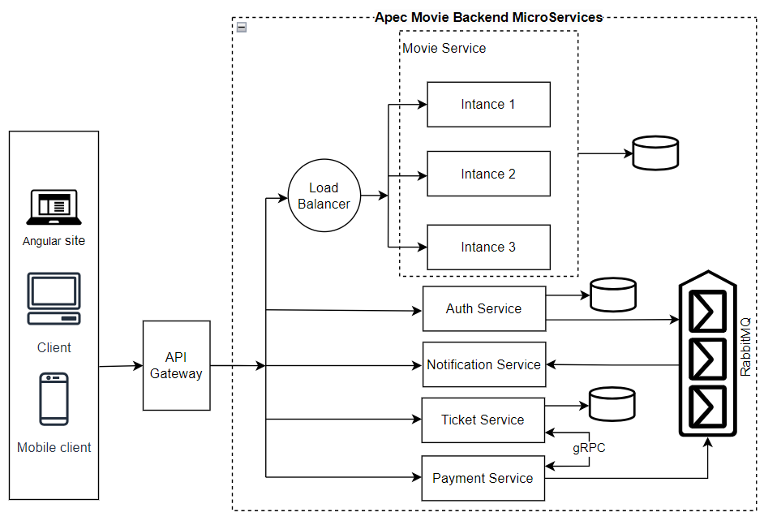
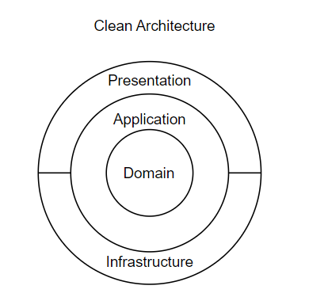

```text
   _____                           ________
  /  _  \ ______   ____   ____    /  _____/______  ____  __ ________
 /  /_\  \\____ \_/ __ \_/ ___\  /   \  __\_  __ \/  _ \|  |  \____ \
/    |    \  |_> >  ___/\  \___  \    \_\  \  | \(  <_> )  |  /  |_> >
\____|__  /   __/ \___  >\___  >  \______  /__|   \____/|____/|   __/
        \/|__|        \/     \/          \/                   |__|

   ApecMovie project with MicroServices
```

## Overview

## Prerequisite





- Dotnet Core Version 6.0
- Docker
- Rabbit MQ
- gRPC
- Minio
- Swagger Doc
- Postgre SQL

## Technical Stacks

- C#
- ASP.NET CORE web API
- ASP.NET CORE MVC
- Blazor

---

## Features

- Register, login, authen & author (JWT).
- Moive manangerment.
- Ticket managerment.
- User managerment.
